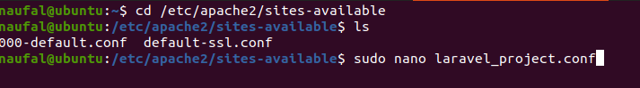
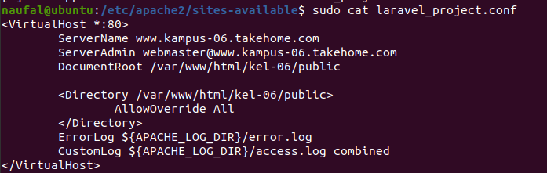
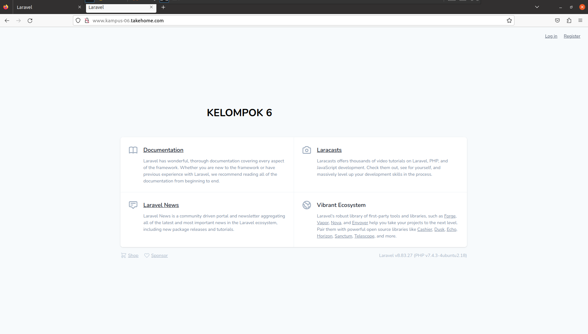

# Laporan Konfigurasi Laravel dan Deployment

### Dosen pengampu: Dr. Ferry Astika Saputra. S.T, M.Sc.

### 1. Vanessa Florentina Patricia (3121600001)

### 2. Achmad Zahir Wajdi (3121600012)

### 3. M. Naufal Ikrom (3121600019)

### Kelas : 2 D4 Teknik Informatika A
<br>

# Instalasi Laravel dan Development
## 1. Install Composer
Untuk menginstall Composer anda bisa mengakses website ini https://getcomposer.org/. Karena kita menggunakan ubuntu, maka ketikkan pada terminal seperti berikut.
```
curl -sS https://getcomposer.org/installer | php
```
Untuk mengecek apakah Composer sudah terinstall atau belum, ketikkan perintah berikut.
```
sudo mv composer.phar /usr/local/bin/composer
sudo chmod +x /usr/local/bin/composer
```

## 2. Install Laravel
Untuk menginstall Laravel, ketikkan perintah berikut.
```
sudo composer create-project laravel/laravel kel-06
```
Setelah laravel terinstall ketikkan perintah berikut.
```
cd kel-06
php artisan serve
```
Perintah tersebut untuk mengaktifkan server Laravel dan bisa menampilkan template laravel di localhost.

## 3. Deployment Laravel
Pindah folder Laravel ke **var/www/html/**.
```
sudo mv kel-06 /var/www/html/
```
Lalu atur permission untuk memastikan proyek dapat berjalan tanpa masalah.
```
sudo chmod -R 775 /var/www/html/kel-06/storage
```
Buat virtual host baru untuk proyek ini dengan menjalankan perintah berikut:



Maka akan terbuka laravel_project.conf dengan menggunakan nano. Namun di sini saya menampilkan hasil `sudo cat`.



Pada gambar terlihat saya menambahkan public setelah html/ dan ganti thedomain.com dengan nama server kelompok masing masing, lalu simpan dan tutup file.

Refresh file konfigurasi virtual host di Apache dengan menjalankan perintah ini:
```
sudo a2dissite 000-default.conf
sudo a2ensite laravel_project
```

Aktifkan Apache rewrite module, lalu restart layanan Apache:
```
sudo a2enmod rewrite
sudo systemctl restart apache2
```

