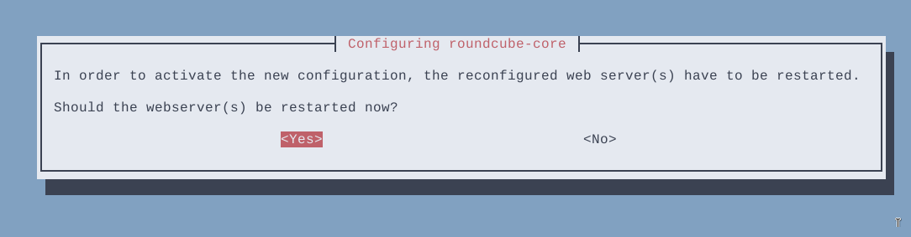

# Laporan Konfigurasi Mail Server di Ubuntu

### Dosen pengampu: Dr. Ferry Astika Saputra. S.T, M.Sc.

### 1. Vanessa Florentina Patricia (3121600001)

### 2. Achmad Zahir Wajdi (3121600012)

### 3. M. Naufal Ikrom (3121600019)

### Kelas : 2 D4 Teknik Informatika A
<br>

# Pendahuluan
**Mail server** adalah sebuah sistem yang membantu dalam pendistribusian email, baik dalam proses menerima atau mengirim. Secara sederhana, mail server adalah perantara dalam proses pengiriman dan penerimaan surat. Email yang dikirim akan disimpan pada mail server, kemudian selanjutnya diforward oleh mail server ke penerima.

**Postfix** adalah mail transfer agent free dan open source. Postfix merupakan mail transfer agent default untuk sejumlah sistem operasi bertipe Unix. Postfix didistribusikan menggunakan Lisensi Umum IBM 1.0 yang merupakan lisensi perangkat lunak bebas tetapi tidak kompatibel dengan GPL. Salah satu ketangguhan Postfix adalah kemampuannya menahan “buffer overflow”. Ketangguhan lainnya adalah kesanggupan Postfix memproses surat elektronik dalam jumlah banyak.

**Dovecot** adalah server email IMAP dan POP3 open source untuk sistem Linux / UNIX, yang ditulis dengan mengutamakan keamanan. Dovecot adalah pilihan yang sangat baik untuk instalasi kecil dan besar. Cepat, mudah diatur, tidak memerlukan administrasi khusus dan hanya menggunakan sedikit RAM/memori.

**Roundcube** adalah email client IMAP berbasis web. Fitur Roundcube yang paling menonjol adalah penggunaan teknologi Ajax. Salah satu software open source yang berlisensi GNU General Public License (GPL).

# Konfigurasi Postfix dan Dovecot
Sebelum memulai install mail server, ada baiknya siapkan domain khusus yang akan digunakan untuk konfigurasi mail server. Dalam contoh konfigurasi kali ini akan menggunakan nama domain `kampus-06.takehome.com` yang dibuat menggunakan bind9 secara lokal.

## Instalasi Postfix dan Dovecot
Update repository dan install package postfix.
```
sudo apt update
sudo apt install postfix dovecot-imapd dovecot-pop3d
```

## Konfigurasi Postfix
Setelah installasi selesai akan muncul message box, kemudian pilih internet site agar komunikasi email menggunakan protokol SMTP secara langsung.


Setelah itu akan muncul message box untuk memasukkan nama domain yang akan digunakan. Masukkan nama domain yang telah dibuat sebelumnya.


Setelah itu, postfix akan menyelesaikan installasinya. Setelah Installasi selesai, edit file di `/etc/postfix/main.cf` dan tambahkan `home_mailbox = Maildir/` pada baris paling bawah.

```
sudo nano /etc/postfix/main.cf
```

```
...
inet_interfaces = all
inet_protocols = all

#tambahkan baris berikut pada baris paling bawah
home_mailbox = Maildir/
```

buat mail directory di directory `/etc/ske`

```
maildirmake.dovecot /etc/skel/Maildir
```

Setelah itu masukkan perintah berikut
```
dpkg-reconfigure postfix
```
Pilih beberapa pilihan dan isikan beberapa input yang akan muncul, sesuaikan dengan topology/konfigurasi sistem dan kebutuhan.


Restart postfix service.
```
systemctl restart postfix
```

## Konfigurasi Dovecot
Edit file konfigurasi `/etc/dovecot/dovecot.conf`.

```
sudo nano /etc/dovecot/dovecot.conf
```

Uncomment dan edit baris berikut.
```
...
# If you want to specify non-default ports or anything more complex,
# edit conf.d/master.conf.
listen = *
...
```

Edit file konfigurasi `/etc/dovecot/conf.d/10-auth.conf`.
```
sudo nano /etc/dovecot/conf.d/10-auth.conf
```

Uncomment dan ganti dari yes ke no.
```
...
# connection is considered secure and plaintext authentication is allowed.
# See also ssl=required setting.
disable_plaintext_auth = no
...
```

Edit file konfigurasi `/etc/dovecot/conf.d/10-mail.conf`.
```
sudo nano /etc/dovecot/conf.d/10-mail.conf
```

Uncomment pada baris berikut.
```
...
mail_location = maildir:~/Maildir
...
```

Beri comment pada baris berikut.
```
...
# mail_location = mbox:~/mail:INBOX=/var/mail/%u
...
```

Restart dovecot service.
```
systemctl restart dovecot
```

## Menambahkan User Email
Tambahkan beberapa user dan password menggunakan perintah adduser yang akan digunakan untuk user email. Pada percobaan kali ini akan membuat dua user, yaitu satu dan dua.

```
adduser satu
```

```
adduser dua
```

Restart postfix dan dovecot service.
```
systemctl restart postfix dovecot
```

## Testing Postfix dan Dovecot menggunakan Telnet
Install package telnet.
```
sudo apt install telnet
```

Test kirim file menggunakan perintah `telnet <nama domain> <port>` dengan menggunakan port 25 (SMTP). Masukkan nama alamat pengirim menggunakan `mail from:`. Masukkan nama alamat penerima menggunakan `rcpt to:`. Ketikkan data lalu enter. Isikan subject dengan mengetikkan `Subject: <isi subject>`. Lalu isikan pesan yang akan dikirim kemudian isikan titik (.) untuk mengakhiri pesan.

```
telnet localhost 25
```


Melihat pesan menggunakan perintah `telnet <nama domain> <port>`. Login user menggunakan `user <nama user>`. Dan masukkan password menggunakan `pass <password>`. Untuk melihat list pesan yang diterima menggunakan perintah `list`. Dan untuk membuka pesan yang diterima menggunakan perintah `retr <nomer pesan>`.<br> Perintah `quit` untuk keluar dari telnet.

```
telnet localhost 110
```


# Konfigurasi Roundcube
## Install Mariadb dan Roundcube
Install roundcube sebagai webmail yang akan digunakan oleh client, dan package mariadb yang nantinya akan digunakan sebagai database dari roundcube.

```
sudo apt install mariadb-server roundcube
```

Pilih yes untuk membuat database secara otomatis oleh roundcube.


Masukkan password database roundcube.


Edit file `/etc/roundcube/config.inc.php`.
```
sudo nano /etc/roundcube/config.inc.php
```

Isikan default host dengan nama domain mail server.
```
...
// For example %n = mail.domain.tld, %t = domain.tld
$config['default_host'] = 'kampus-06.takehome.com';
...
```

Ganti smtp server dengan nama domain mail server.
```
...
// For example %n = mail.domain.tld, %t = domain.tld
$config['smtp_server'] = 'kampus-06.takehome.com';
...
```


Ganti smtp port dari 587 ke 25.
```
...
// SMTP port. Use 25 for cleartext, 465 for Implicit TLS, or 587 for STARTTLS (default)
$config['smtp_port'] = 25;
...
```

Kosongkan value dari smtp user.
```
...
// will use the current username for login
$config['smtp_user'] = '';
...
```

Kosongkan value dari smtp password.
```
...
// will use the current user's password for login
$config['smtp_pass'] = '';
...
```

Configure ulang roundcube (langkah ini bisa dilewati).
```
dpkg-reconfigure roundcube-core
```


Kosongkan karena kita tidak menggunakan tls.


Pilih bahasa untuk roundcube.


Pilih no jika tidak ingin reinstall database yang telah dibuat.


Check pada pilihan apache dan uncheck lighttpd.


Pilih yes untuk merestart web server.


Keep local version jika tidak ingin merubah versi roundcube ke yang lebih terbaru.


Edit apache config untuk memasukkan konfigurasi tambahan dari roundcube ke apache config.
```
sudo nano /etc/apache2/apache2.conf
```

Tambahkan pada baris paling bawah.
```
Include /etc/roundcube/apache.conf
```


Selanjutnya, masuk ke directory website apache dan tambahkan file baru untuk mail server.
```
cd /etc/apache2/sites-available
sudo touch mail.conf
sudo nano mail.conf
```


Disable apache default config dan enable kan mail config.
```
a2dissite 000-default.conf
a2ensite mail.conf
```

Restart apache service.
```
systemctl restart apache2
```