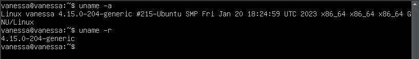
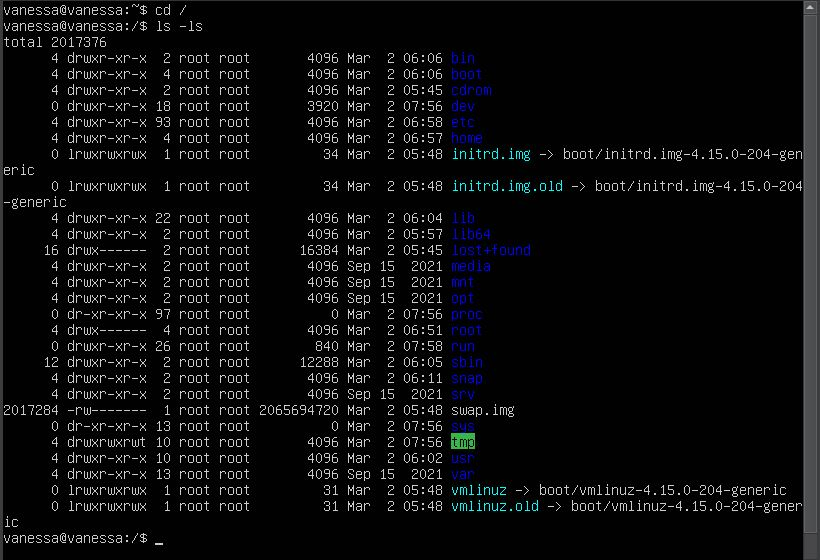
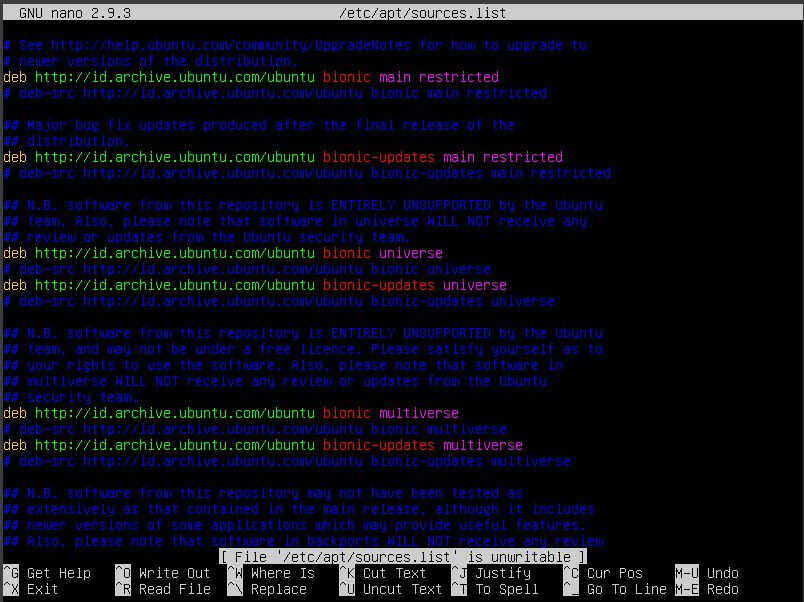
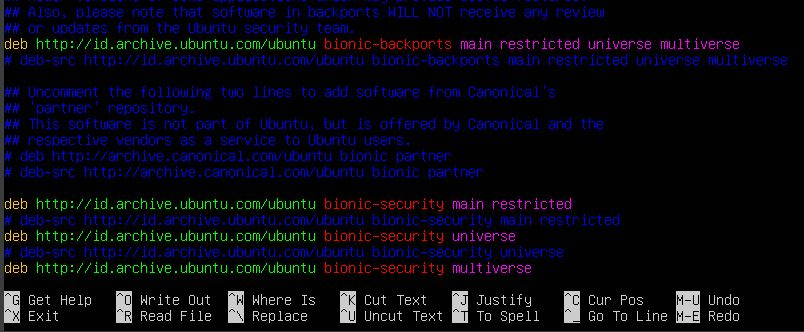
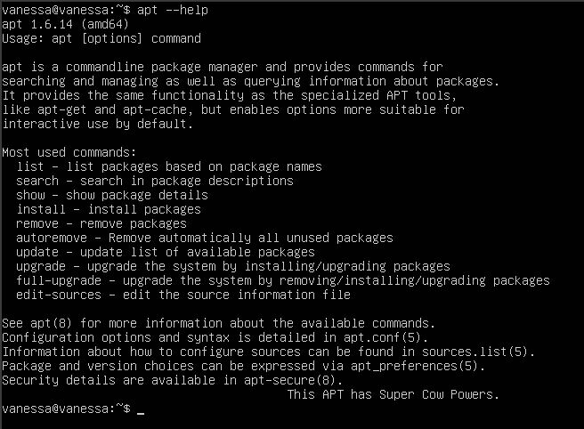

# Laporan Workshop Minggu ke-2
Pada laporan kali ini, saya akan mengidentifikasi kernel, struktur direktori, perbedaan sudo dan su, jenis repository, dan perintah apt. Berikut hasil identifikasi saya :

 

# 1. Identifikasi Kernel
Kernel merupakan bagian terpenting dari sebuah sistem operasi yang berfungsi sebagai jembatan antara perangkat keras dan perangkat lunak. Kernel bertanggung jawab untuk mengatur sumber daya sistem seperti memori, CPU, disk, dan perangkat input/output lainnya, serta mengelola dan menyediakan akses ke berbagai layanan sistem seperti sistem file, jaringan, dan keamanan.

Terdapat 2 perintah bash yang saya ketahui untuk melihat versi kernel, yaitu :

    uname -a
yang akan menampilkan informasi sistem secara lengkap, termasuk nama host, versi kernel, jenis arsitektur sistem, dan informasi sistem lainnya.

    uname -r
yang hanya akan menampilkan nomor versi kernel saja.

Pada gambar di atas, terlihat bahwa ubuntu saya memiliki versi kernel 4.15.0-204-generic.

 

# 2. Identifikasi Directory Structure
Struktur direktori pada Ubuntu umumnya mengikuti standar Filesystem Hierarchy Standard (FHS) yang merupakan standar yang digunakan oleh mayoritas distribusi Linux.

Berikut penjelasan dari beberapa struktur direktori yang saya temukan :
1. **/bin** : direktori yang berisi file biner (eksekutabel) yang dibutuhkan untuk menjalankan sistem, seperti ls, mkdir, rm, dan sebagainya.
2. **/boot** : direktori yang berisi kernel sistem dan file terkait sistem boot.
3. **/dev** : direktori yang berisi file perangkat (device files), seperti keyboard, mouse, dan sebagainya.
4. **/etc** : direktori yang berisi file konfigurasi sistem dan aplikasi.
5. **/lib** : direktori yang berisi library (pustaka) yang dibutuhkan oleh program yang terinstal di sistem.
6. **/sbin** : direktori yang berisi file biner (eksekutabel) untuk administrator sistem.
7. **/tmp** : direktori yang digunakan untuk menyimpan file sementara (temporary files).
8. **/usr** : direktori yang berisi file dan direktori umum, seperti program, library, header file, dan sebagainya.
9. **/var** : direktori yang berisi file yang sering berubah, seperti log sistem, file cache, dan sebagainya.

 

# 3. Identifikasi Perbedaan *su* dengan *sudo*
**`su`** dan **`sudo`** adalah dua perintah yang sering digunakan pada sistem operasi Linux untuk memperoleh hak akses superuser (root) untuk menjalankan tugas administratif. Namun, kedua perintah ini memiliki perbedaan dalam cara kerjanya.

**`su`** adalah singkatan dari "**switch user**" dan digunakan untuk beralih ke akun pengguna lain, termasuk akun root. Saat menjalankan perintah `su`, pengguna diminta untuk memasukkan kata sandi akun root. Setelah kata sandi yang benar dimasukkan, shell (lingkungan kerja shell) beralih ke akun root dan pengguna dapat menjalankan perintah dengan hak akses **superuser**. Namun, perintah `su` harus dijalankan sebagai pengguna dengan hak akses **superuser** atau sebagai pengguna lain yang memiliki hak akses ke akun root.

**`sudo`** adalah singkatan dari "**superuser do**" dan digunakan untuk menjalankan perintah sebagai pengguna dengan hak akses superuser, tanpa harus beralih ke akun root secara penuh. Saat menjalankan perintah `sudo`, pengguna diminta untuk memasukkan kata sandi pengguna, bukan kata sandi root. Setelah kata sandi yang benar dimasukkan, perintah yang dijalankan dijalankan dengan hak akses **superuser**. Perintah `sudo` memungkinkan pengguna untuk menjalankan perintah tertentu dengan hak akses superuser, tanpa harus masuk ke akun root sepenuhnya. Selain itu, pengguna yang diizinkan untuk menjalankan perintah `sudo` dapat dikonfigurasi oleh administrator sistem.

    sudo su

    sudo su -

 

# 4. Identifikasi Jenis Repository
    nano /etc/apt/sources.list

Berikut maksud dari isi file sources.list :
- `deb http://archive.ubuntu.com/ubuntu/ bionic main restricted` : ini adalah repository utama dari Ubuntu 18.04 LTS (Bionic Beaver) yang berisi paket-paket utama yang didukung oleh Ubuntu, baik untuk sistem inti (main) maupun untuk driver perangkat keras terbatas (restricted).

- `deb http://archive.ubuntu.com/ubuntu/ bionic-updates main restricted` : ini adalah repository untuk pembaruan perangkat lunak (updates) dari paket-paket utama (main dan restricted).

- `deb http://archive.ubuntu.com/ubuntu/ bionic universe` : ini adalah repository yang berisi paket-paket perangkat lunak bebas yang didukung oleh komunitas Ubuntu.

- `deb http://archive.ubuntu.com/ubuntu/ bionic-updates universe` : ini adalah repository untuk pembaruan perangkat lunak (updates) dari paket-paket bebas di repository universe.

- `deb http://archive.ubuntu.com/ubuntu/ bionic multiverse` : ini adalah repository yang berisi paket-paket perangkat lunak non-bebas yang tidak didukung oleh Ubuntu.

- `deb http://archive.ubuntu.com/ubuntu/ bionic-updates multiverse` : ini adalah repository untuk pembaruan perangkat lunak (updates) dari paket-paket non-bebas di repository multiverse.

- `deb http://archive.ubuntu.com/ubuntu/ bionic-backports main restricted universe multiverse` : ini adalah repository yang berisi paket-paket perangkat lunak baru yang belum ada di versi Ubuntu saat ini.

- `deb http://archive.canonical.com/ubuntu bionic partner` : ini adalah repository dari Canonical (perusahaan di balik Ubuntu) yang berisi paket-paket perangkat lunak yang didukung oleh Canonical.

- `deb http://security.ubuntu.com/ubuntu/ bionic-security main restricted` : ini adalah repository untuk pembaruan keamanan dari paket-paket utama (main dan restricted).

- `deb http://security.ubuntu.com/ubuntu/ bionic-security universe` : ini adalah repository untuk pembaruan keamanan dari paket-paket bebas di repository universe.

- `deb http://security.ubuntu.com/ubuntu/ bionic-security multiverse` : ini adalah repository untuk pembaruan keamanan dari paket-paket non-bebas di repository multiverse.

 

# 5. Identifikasi Perintah *apt*

    apt --help

Perintah yang paling sering digunakan:
- `list` - daftar paket berdasarkan nama paket
- `search` - mencari dalam deskripsi paket
- `show` - menampilkan detail paket
- `update` - memperbarui daftar paket yang tersedia
- `install` - menginstal satu atau lebih paket
- `remove` - menghapus satu atau lebih paket
- `autoremove` - Menghapus semua paket yang tidak terpakai secara otomatis
- `upgrade` - memperbarui sistem dengan menginstal/memperbarui paket
- `full-upgrade` - memperbarui sistem dengan menghapus/menginstal/memperbarui paket
- `edit-sources` - mengedit file informasi sumber