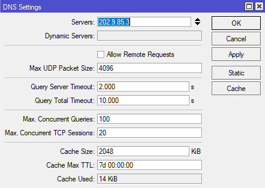
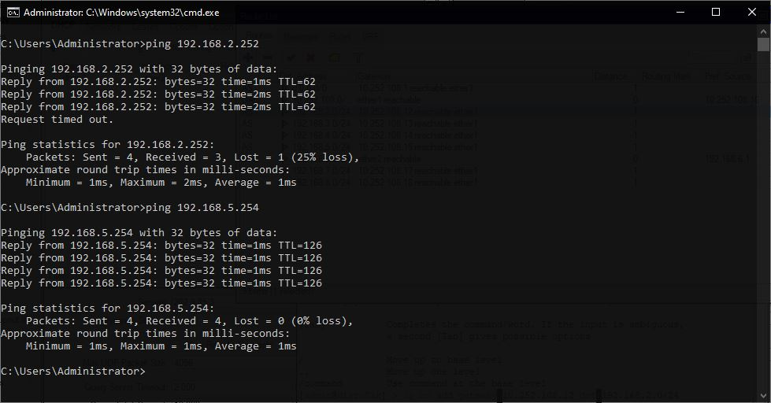

# Laporan Workshop Administrasi Jaringan

### 1. Vanessa Florentina Patricia (3121600001)

### 2. Achmad Zahir Wajdi (3121600012)

### 3. M. Naufal Ikrom (3121600019)

### Kelas : 2 D4 Teknik Informatika A

# Create DNS

### 1. Reset Configuration Router - 6

Reset Konfigurasi dilakukan dengan menggunakan software Winbox

Akses fitur di bagian sidebar pada menu System -> pilih Reset Configuration -> centang No Default Configuration -> klik Reset Configuration.

Setelah itu akan otomatis melakukan rebooting pada router dan aplikasi akan melakukan reconnecting.

### 2. Config IP Local dan Public

Setelah rebooting akses fitur di sidebar pada menu IP -> Addresses -> klik tombol "+" ->

**ETHER 1**

- Address = 10.252.108.16/24
- Network = 10.252.108.0
- Interface = ETHER 1

**ETHER 2**

- Address = 192.168.6.1/24
- Network = 192.168.6.0
- Interface = ETHER 2

### Config Default Route

Akses fitur di sidebar pada menu New Terminal, berikan perintah berikut :

        ip route add dst-address=0.0.0.0/0 gateway=10.252.108.1
        ip ro pr

### Config DNS

Akses fitur di sidebar pada menu IP -> DNS -> masukkan IP Server=202.9.85.3

### Config internet Client

Untuk config client, config yang diterapkan hanya DHCP server karena client hanya tinggal IP nya saja menggunakan perintah

        /ip pool
        add name=dhcp_pool0 ranges=192.168.5.2-192.168.5.254
        /ip dhcp-server network
        add address=192.168.5.0/24 gateway=192.168.5.1
        /ip dhcp-server
        add address-pool=dhcp_pool0 disabled=no interface=ether2 name=dhcp1

### Menambahkan tabel routing

Ketikkan pada New Terminal Winbox

        ip ro add gateway 10.252.108.11 dst 192.168.1.0/24
        ip ro add gateway 10.252.108.12 dst 192.168.2.0/24
        ip ro add gateway 10.252.108.13 dst 192.168.3.0/24
        ip ro add gateway 10.252.108.14 dst 192.168.4.0/24
        ip ro add gateway 10.252.108.15 dst 192.168.5.0/24
        ip ro add gateway 10.252.108.17 dst 192.168.7.0/24
        ip ro add gateway 10.252.108.18 dst 192.168.8.0/24
        ip ro add gateway 10.252.108.19 dst 192.168.9.0/24

### Test Ping

