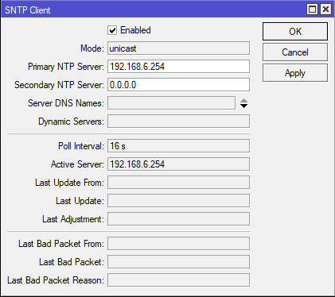

# Laporan Konfigurasi NTP pada Linux Workshop Administrasi Jaringan
### Dosen pengampu: Dr. Ferry Astika Saputra. S.T, M.Sc.

### 1. Vanessa Florentina Patricia (3121600001)

### 2. Achmad Zahir Wajdi (3121600012)

### 3. M. Naufal Ikrom (3121600019)

### Kelas : 2 D4 Teknik Informatika A

# Instalasi NTP Server Ubuntu
Lakukan perintah di bawah ini untuk melakukan instalasi NTP

```
sudo apt-get install ftp
```

Kemudian tunggu proses instalasi sampai berhasil, dan ntp berhasil ter-install di perangkat.


# Konfigurasi NTP Client Mikrotik ke Server Ubuntu

## 1. Membuka file konfigurasi ntp server
Untuk membuka file konfigurasi ntp, gunakan perintah berikut.

```
sudo gedit /etc/ntp.conf
```


kemudian masukkan konfigurasi berikut kedalam file nya

```
pool 0.ubuntu.pool.ntp.org iburst
pool 1.ubuntu.pool.ntp.org iburst
pool 2.ubuntu.pool.ntp.org iburst
pool 3.ubuntu.pool.ntp.org iburst
```


kemudian simpan konfigurasi.

## 2. Menjalankan ntp
Selanjutnya pastikan bahwa ntp sudah dijalankan menggunakan perintah berikut.

```
sudo service ntp status
```

Jika ntp sudah berjalan maka akan tampil seperti berikut


Kita bisa mengecek ntp server berjalan atau tidak pada terminal kita menggunakan perintah berikut.

```
netstat -nlptu
```


Pada gambar tersebut terlihat bahwa daemon dari ntp berjalan pada port 53 dengan protokol UDP.

Kita bisa mengecek tanggal pada terminal kita menggunakan perintah berikut.

```
date
```


## 3. NTP Client
Selanjutnya kita akan mengkonfigurasi NTP Client pada mikrotik kita bisa mengaturnya seperti berikut pada bagian `System -> SNTP Client`, kemudian simpan.



Konfigurasi yang perlu disesuaikan adalah primary NTP Server dan status enable dari ntp client itu sendiri.

# Hasil
Setelah semua konfigurasi dilakukan, kita bisa mengecek waktu pada mikrotik, jika berhasil maka waktu di mikrotik dan server akan sama.

