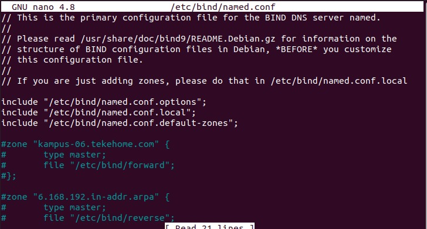
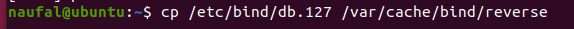

# Laporan Konfigurasi DNS Server pada Linux Workshop Administrasi Jaringan

### Dosen pengampu: Dr. Ferry Astika Saputra. S.T, M.Sc.

### 1. Vanessa Florentina Patricia (3121600001)

### 2. Achmad Zahir Wajdi (3121600012)

### 3. M. Naufal Ikrom (3121600019)

### Kelas : 2 D4 Teknik Informatika A

#
## DNS ?
Domain Name Server atau DNS adalah sebuah sistem yang menghubungkan Uniform Resource Locator (URL) dengan Internet Protocol Address (IP Address). Dengan menggunakan DNS maka akan lebih lebih mudah untuk dipakai dan juga akan lebih aman.

DNS adalah sistem yang meringkas pekerjaan ini untuk Anda. Kini, Anda tinggal mengingat nama domain dan memasukkannya dalam address bar. DNS kemudian akan menerjemahkan domain tersebut ke dalam IP Address yang komputer pahami contoh mengakses Google. kita tidak menulis 172.217.0.142 ke dalam address bar, namun memasukkan alamat Google.com. 

## Fungsi DNS
1. Meminta informasi IP Address sebuah website berdasarkan nama domain
2. Meminta informasi URL sebuah website berdasarkan IP Address yang dimasukkan;
3. Mencari server yang tepat untuk mengirimkan email.


## Macam-Macam DNS
Berikut adalah 10 DNS record yang paling sering dijumpai:

1. A Record atau Address record ─ menyimpan informasi soal hostname, time to live (TTL), dan IPv4 Address.
2. AAA Record ─ menyimpan informasi hostname dan hubungannya dengan IPv6 address.
3.  MX Record ─ merekam server SMTP yang khusus digunakan untuk saling berkirim email di suatu domain.
4.  CNAME Record ─ digunakan untuk me-redirect domain atau subdomain ke sebuah IP Address. Lewat fungsi satu ini, Anda tak perlu memperbarui DNS record.
5.  NS Record ─ merujuk subdomain pada authoritative name server yang diinginkan. Record ini berguna jika subdomain Anda di web hosting berbeda dengan domain.
6. PTR Record ─ memberikan izin pada DNS resolver untuk menyediakan informasi soal IP Address dan menampilkan hostname (reverse DNS lookup).
7. CERT Record ─ menyimpan sertifikat enkripsi atau sertifikat keamanan.
8. SRV Record ─ menyimpan informasi terkait lokasi komunikasi, semacam Priority, Name, Weight, Port, Points, dan TTL
9. TXT Record ─ membawa dan menyalurkan data yang hanya bisa dibaca oleh mesin.
10. SOA Record ─ bagian yang muncul di awal dokumen DNS zone. Bagian yang sama juga merujuk pada Authoritative Name Server serta informasi lengkap sebuah domain.
#
## Langkah - Langkah untuk Instalasi dan Konfigurasi DNS

## Demo Konfigurasi DNS
[Demo Konfigurasi DNS](https://penssby-my.sharepoint.com/:v:/g/personal/3121600012_msoffice_pens_ac_id/EXYdKfakjTZNm6xlm9IzlqYBo82MoojIqwF_K8JhfhEIAw?e=Mp8jVw)


## Instalasi DNS
1. Melakukan pembaruhan untuk linux (kali ini saya memakai Ubuntu)
```
> sudo apt-get update
> sudo apt-get upgrade
```

2. Menginstall package **bind9** dan **bind9utils**
```
> sudo apt-get install bind9 bind9utils
```

## Konfigurasi DNS

1. Buka file named-conf, disini kami menggunakan software nano untuk mengeditnya

    
    
    Mengganti konfigurasi pada named-conf
 
    


    berikut isi dari:
    > "/etc/bind/named.conf.option"

    

    > "/etc/bind/named.conf.local"

    

    > "/etc/bind/named.conf.default.zones"

    


2. Membuat file forward dengan cara mengcopy file db.local
   
   

   Membuka file forward sesuai dengan tempat file tersebut disimpan

   

   Mengganti konfigurasi pada forward

   
   
   Rubahkan root menjadi ns, localhost name dengan hostname "kampus-06.takehome.com", dan juga IPnya sesuaikan dengan IP anda. lalu ikuti konfigurasi dibawahnya


3. Membuat file reverse dengan cara mengcopy file db.127
   

   Membuka file reverse sesuai dengan tempat file tersebut disimpan

   

   Mengganti konfigurasi pada forward

   

   Rubahkan root menjadi ns, localhost name dengan hostname "kampus-06.takehome.com", dan 1.0.0 menjadi bilangan IP okter terakhir anda. lalu ikuti konfigurasi dibawahnya

4. Konfigurasi resolve
5. 
   

6. Restart Bind9 dan Cek status bind9
   ```
   > systemctl restart bind9.service
   > systemctl status bind9.service
   ```
   
#
## Pengujian DNS
1. Menginstall package **dnsutils**
    ```
    > sudo aptinstall dnsutils
    ```


2. Melakukan pengujian

   